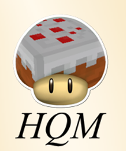

# 极限任务模式：为社区而作

[English](./README.md) | 简体中文

  

> [!TIP]
> [在这里查看此分支的文档](./WIKI_zh.md)

## 简介

HQM为游戏添加了任务系统，可以用于指引玩家或给予奖励

拥有以下功能：
- 次数耗尽将无法重生，类似极限模式
- 团队、声望、奖励袋子

## 赞助

## 开源协议

本项目采用 [GPL-3.0](./LICENSE) 协议开源
